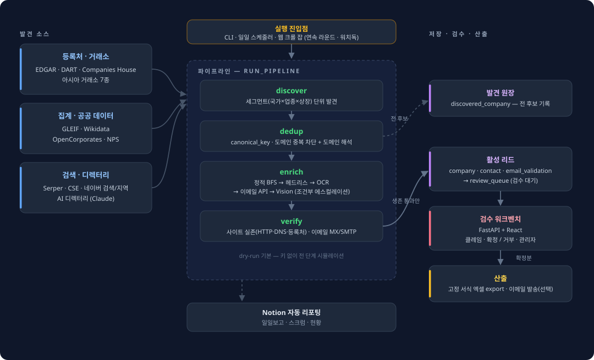

# lead-crawler

[](https://github.com/wjdtjddns98/lead-crawler/actions/workflows/ci.yml)
[](pyproject.toml)
[](leadcrawler/api)
[](web)

전 산업·전 기업(상장+비상장)의 IR 연락처 — 이메일·전화·문의폼 — 를 자동 수집하고,
웹앱에서 사람이 검증한 뒤 고정 엑셀 서식으로 내보내는 B2B 리드 수집 시스템.

```
discover → dedup → enrich → verify → 저장 → 사람 검수 → export
```

- 기본값이 dry-run — `LEADCRAWLER_DRY_RUN=true`면 외부 API 키 없이 전 과정이 시뮬레이션으로 동작
- 한 번 수집한 기업은 `canonical_key`·도메인 기준으로 다시 추출하지 않음
- 사이트 생존 검증을 통과한 기업만 검수 큐로 승격(전 후보는 발견 원장에 기록)

## 빠른 시작

의존성 관리는 [uv](https://docs.astral.sh/uv/)를 쓴다.

```bash
uv sync                 # .venv + 런타임 + dev 도구(pytest, ruff, mypy)
uv run pytest -q        # 단위 테스트는 네트워크 없이 통과
uv run leadcrawler run --country KR --industry 건설 --out exports/leads.xlsx
```

기능별 extra: `--extra api`(웹앱) · `--extra db`(psycopg) · `--extra crawl`(헤드리스) ·
`--extra ocr` · `--all-extras`. 운영 설치는 `uv sync --no-dev --extra api --extra db`.

## 검증 웹앱

운영 DB는 PostgreSQL(단위 테스트는 SQLite), 스키마는 Alembic으로 관리한다.

```bash
docker compose up -d               # 로컬 PostgreSQL
uv sync --extra api --extra db
uv run leadcrawler db-upgrade      # alembic upgrade head
uv run leadcrawler web
```

프론트를 빌드해 두면(`cd web && npm install && npm run build`) 백엔드가 `web/dist`를
같은 출처로 서빙하므로 CORS나 `VITE_API_BASE` 설정이 필요 없다. 빌드가 없으면
API(`/docs`)만 동작한다.

## 아키텍처

<p align="center">
  
</p>

```
leadcrawler/
  sources/      발견 어댑터 — 등록처·거래소·공공데이터·검색·AI 디렉터리 + 도메인 해석
  enrich/       연락처 추출 체인 (정적 BFS → 헤드리스 → OCR → 이메일 API → Vision)
  verify/       사이트 실존성 · 이메일 유효성(MX/SMTP/도달성) 검증
  pipeline/     run_pipeline 오케스트레이션 + 웹 크롤 잡(연속 라운드·워치독·후속 채움)
  scheduler/    일일 정기 크롤 + Notion 리포팅 (APScheduler)
  storage/      DB 저장소 — 발견 원장·검수 큐·크롤 잡·커서·감사 로그 + 엑셀 export
  dedup_resolve/ 근접 중복 탐지·병합 (렉시컬 + LLM 판정)
  integrations/ Notion 클라이언트
  api/          FastAPI — 인증·검수 큐·관리자·중복 워크벤치·export·발송
web/            React(Vite) 검수 워크벤치 UI
```

## CLI

```bash
leadcrawler run --country KR --industry 건설 --persist   # 수집 결과를 DB에 영속화
leadcrawler import-existing "기존목록.xlsx"               # 기존 목록 시드(중복 방지 기준)
leadcrawler report 2026-06-18 --done "..." --next "..."  # Notion 리포팅
```

## 배포 (내부망 HTTPS)

리포 루트의 `serve-https.bat` 실행 — 첫 실행 때 자체서명 인증서를 만들고
(호스트명·로컬 IP를 SAN에 포함) `0.0.0.0:8000`에 HTTPS로 띄운다.
포트 변경은 `serve-https.bat -Port 8443`.

자체서명이라 브라우저 최초 접속 시 경고가 한 번 뜬다. 경고 없이 쓰려면
`certs\cert.pem`을 각 클라이언트의 신뢰할 수 있는 루트 인증 기관에 설치한다.

## 기술 스택

Python 3.10+ · Pydantic v2 · SQLAlchemy 2 + Alembic · FastAPI · PostgreSQL · React + Vite · uv
